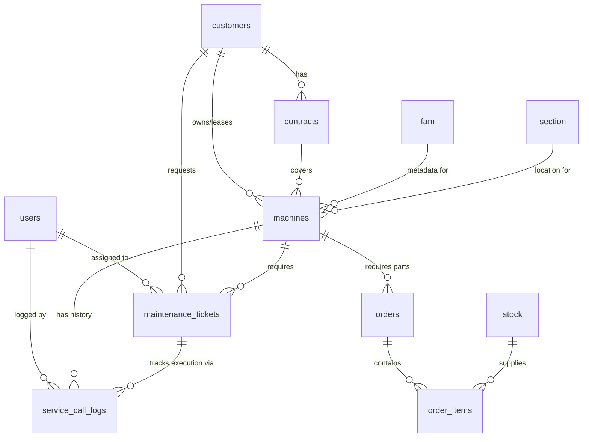

# INHOUSE STOCK: Database Design & Architecture

## Entity Relationship Diagram (ERD)

## Core Tables & Business Rules

1. **`users`**: Workforce identity. Mapped to regions and roles (e.g., tech, warehouse, admin).
2. **`fam`** (Fixed Asset Management): Source of truth for asset metadata (model, make, theoretical throughput, specs).
3. **`section`**: Physical placement/zone of the machine inside a customer's location (e.g., "Cafeteria Level 2").
4. **`customers`**: Client information, CRM core.
5. **`contracts`**: Service Level Agreements, billing types, and coverage linked to customers.
6. **`machines`**: Operational asset table. Links `fam` (what it is) to `section` (where it is) under a `customer`.
7. **`stock`**: Warehouse inventory. Live quantity tracking.
8. **`orders`**: Dispatch/packing workflow for parts going to a customer/machine.
9. **`order_items`**: Joining table for `orders` and `stock`.
10. **`maintenance_tickets`**: High-level service management request (e.g., "Machine leaking").
11. **`service_call_logs`**: Execution history created by technicians working on a `maintenance_ticket`.

## Indexes & Query Optimization

To support high-performance mobile querying and offline-sync conflict resolution, the following indexes are implemented:
* **Foreign Keys**: B-Tree indexes on all foreign keys (`customer_id`, `fam_id`, `section_id`, `machine_id`, `assigned_tech_id`).
* **Lookups**: Hash or B-Tree indexes on `qr_code`, `serial_number`, and `stock.barcode` for instant mobile lookups.
* **Filtering**: Indexes on `status`, `region`, and date fields (`created_at`, `delivery_date`) to optimize dashboard aggregations.

## Row Level Security (RLS) & Access Patterns

Multitenant separation is achieved primarily by Geographic Region and Role:
* **Technicians (`tech`, `road_tech`)**: 
  * Can *read* customers, machines, and tickets within their assigned `region`.
  * Can *update* service call logs and tickets where `assigned_employee_id == auth.uid()`.
* **Warehouse (`warehouse`)**:
  * Can *read* all orders globally (or by warehouse region).
  * Can *update* stock quantities.
* **Admin / Finance (`admin`, `finance`, `ops_manager`)**:
  * Unrestricted *read* access across all regions.
  * Elevated *write* operations.

## Views & Reusable Joins

To avoid heavily nested client-side mapping, we utilize PostgreSQL views:
1. `v_machine_details`: Joins `machines` -> `fam` + `section` + `customers` + `contracts`.
2. `v_tech_dispatch_queue`: Joins `maintenance_tickets` -> `machines` -> `customers` -> `service_call_logs` (active ones) for a flattened mobile view.
3. `v_active_stock_levels`: Summarizes `stock` minus active `order_items` (reserved stock).

## Migration Strategy

1. Extend enums (`app_role`, `app_region`, `ticket_status`).
2. Build lookup tables: `fam`, `section`, `contracts`.
3. Alter `machines` to reference `fam.id` and `section.id`, migrating out raw text.
4. Separate the `maintenance_tickets` (the "WHY") from `service_call_logs` (the "WHAT HAPPENED").
5. Backfill relationships and apply aggressive indexing.
